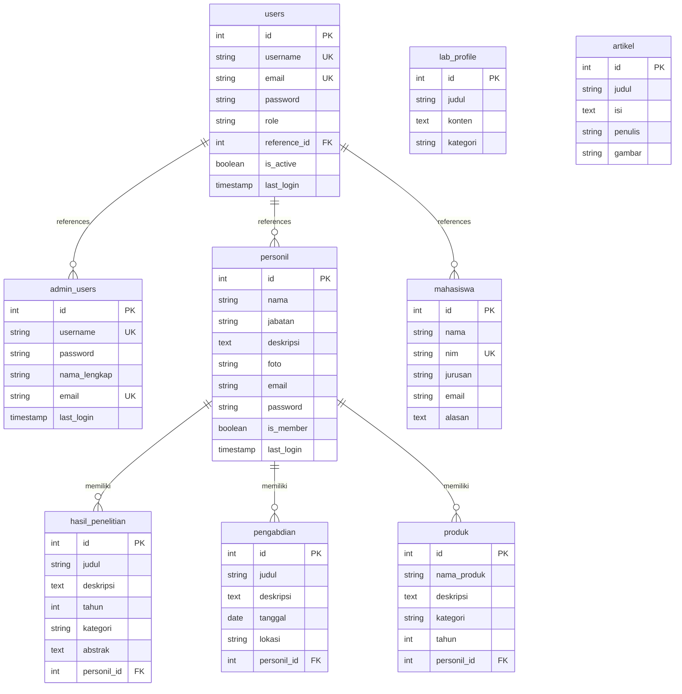

# Lab Software Engineering Website

Website resmi Laboratorium Software Engineering yang dibangun dengan PHP Native, PostgreSQL, dan Bootstrap 5. Sistem ini mencakup portal publik, manajemen admin, dashboard anggota (dosen/staff), dan area mahasiswa.

## 🎨 Fitur Utama

- **Desain Modern & Responsif**: Menggunakan Bootstrap 5 dengan animasi AOS (Animate On Scroll) dan tata letak yang responsif untuk semua perangkat.
- **Multi-Role System**:
    - **Admin**: Kontrol penuh atas konten, pengguna, dan pengaturan situs.
    - **Member (Personil)**: Manajemen profil mandiri dan portofolio (Penelitian, Pengabdian, Produk, Artikel).
    - **Student**: Area khusus mahasiswa untuk interaksi dan manajemen profil.
- **Manajemen Konten Dinamis**:
    - **Landing Page**: Hero section, Visi Misi, dan konten beranda dapat diedit langsung dari Admin.
    - **Portofolio**: Manajemen data Penelitian, Pengabdian Masyarakat, dan Produk Hilirisasi.
    - **Blog/Artikel**: Sistem publikasi artikel dengan editor teks.
- **Fitur Khusus**:
    - **Recruitment Toggle**: Admin dapat membuka/tutup pendaftaran mahasiswa baru.
    - **Activity Log**: Pemantauan aktivitas admin untuk keamanan dan audit.
    - **Social Media Integration**: Tautan sosial media dinamis untuk setiap personil.

## 📁 Struktur Folder

```
labse_web/
├── admin/                   # Dashboard & fitur Admin (Manajemen User, Konten, Landing Page)
├── member/                  # Dashboard Member/Personil (Kelola portofolio mandiri)
├── student/                 # Area Mahasiswa (Profil, Komentar)
├── views/                   # Komponen tampilan publik (Landing page sections)
├── assets/                  # CSS, JS, Images, Vendor libraries
├── includes/                # Konfigurasi DB, Header, Footer, Navbar
├── uploads/                 # Direktori penyimpanan file upload (Foto, Dokumen)
├── database/                # Skema database (SQL)
├── index.php                # Landing Page Utama
├── login.php                # Halaman Login Terpusat
└── README.md                # Dokumentasi Proyek
```

## 🔑 Hak Akses & Modul

### 1. Public (Pengunjung)
- **Beranda**: Informasi umum lab, visi misi, roadmap.
- **Profil Lab**: Detail tentang laboratorium.
- **Personil**: Daftar dosen dan staff beserta profil lengkap.
- **Portofolio**: Daftar Penelitian, Pengabdian, dan Produk.
- **Blog**: Artikel dan berita terbaru.
- **Recruitment**: Form pendaftaran anggota baru (jika dibuka).

### 2. Admin Area (`/admin`)
- **Dashboard**: Statistik ringkas.
- **Manajemen User**: Tambah/Edit/Hapus Personil dan Mahasiswa.
- **Manajemen Konten**: Kelola Artikel, Penelitian, Pengabdian, Produk.
- **Manajemen Landing Page**: Edit teks Hero, About, Visi Misi, dll.
- **Pengaturan**: Toggle status pendaftaran (Recruitment), Lihat Activity Log.

### 3. Member Area (`/member`)
- **Dashboard**: Ringkasan aktivitas pribadi.
- **Profil Saya**: Update biodata, foto, dan password.
- **Portofolio Saya**: Tambah/Edit/Hapus Penelitian, Pengabdian, dan Produk milik sendiri.
- **Artikel Saya**: Tulis dan kelola artikel pribadi.

### 4. Student Area (`/student`)
- **Dashboard**: Informasi mahasiswa.
- **Profil**: Update data diri.
- **Interaksi**: Fitur komentar pada konten tertentu.

## 🚀 Instalasi & Konfigurasi

### Persyaratan Sistem
- PHP 7.4 atau lebih baru
- PostgreSQL 12 atau lebih baru
- Web Server (Apache/Nginx)

### Langkah Instalasi

1.  **Clone/Download Repository**
    Letakkan folder `labse_web` di direktori root web server Anda (misal: `C:\laragon\www\` atau `htdocs`).

2.  **Setup Database**
    - Buat database baru di PostgreSQL bernama `labse` (atau sesuai keinginan).
    - Import file SQL yang ada di folder `database/` (misal: `labse.sql` atau file dump terbaru).

3.  **Konfigurasi Koneksi**
    Buka file `includes/config.php` dan sesuaikan kredensial database:
    ```php
    define('DB_HOST', 'localhost');
    define('DB_PORT', '5432');
    define('DB_NAME', 'labse');
    define('DB_USER', 'postgres'); // User default PostgreSQL
    define('DB_PASS', 'password_anda');
    ```

4.  **Akses Website**
    Buka browser dan akses `http://localhost/labse_web`.

## 🛠 Troubleshooting

-   **Error Koneksi Database**: Pastikan service PostgreSQL berjalan dan kredensial di `config.php` benar. Pastikan ekstensi `pdo_pgsql` atau `pgsql` aktif di `php.ini`.
-   **Gambar Tidak Muncul**: Pastikan folder `uploads/` memiliki izin tulis (write permission) jika di lingkungan Linux/Unix.
-   **Halaman 404**: Cek konfigurasi `BASE_URL` jika ada, atau pastikan struktur folder tidak berubah.

## 🗄️ Struktur Database

Sistem ini menggunakan PostgreSQL sebagai database management system dengan struktur yang terorganisir untuk mendukung multi-role authentication dan manajemen konten.

### Tabel-Tabel Utama

#### 1. `users` - Tabel Autentikasi Pusat
Tabel ini berfungsi sebagai pusat autentikasi untuk semua pengguna sistem (admin, personil, dan mahasiswa).

**Kolom-kolom:**
- `id`: Primary key (auto-increment)
- `username`: Username unik untuk login
- `email`: Email unik pengguna
- `password`: Password terenkripsi (bcrypt)
- `role`: Role pengguna (`admin`, `personil`, `mahasiswa`)
- `reference_id`: ID referensi ke tabel asli sesuai role
- `is_active`: Status aktif pengguna (Boolean)
- `last_login`: Waktu login terakhir
- `created_at`, `updated_at`: Timestamp otomatis

#### 2. `admin_users` - Data Administrator
Menyimpan informasi lengkap administrator sistem.

**Kolom-kolom:**
- `id`: Primary key
- `username`: Username admin (unik)
- `password`: Password terenkripsi
- `nama_lengkap`: Nama lengkap admin
- `email`: Email admin (unik)
- `last_login`: Waktu login terakhir
- `created_at`: Timestamp pembuatan

#### 3. `personil` - Data Dosen/Staff (Member)
Menyimpan profil lengkap dosen dan staff laboratorium yang juga berfungsi sebagai member area.

**Kolom-kolom:**
- `id`: Primary key
- `nama`: Nama lengkap personil
- `jabatan`: Jabatan/posisi
- `deskripsi`: Deskripsi singkat atau bio
- `foto`: Path file foto profil
- `email`: Email personil
- `password`: Password untuk member login (nullable)
- `is_member`: Flag apakah personil aktif sebagai member (Boolean)
- `last_login`: Waktu login terakhir untuk member
- `created_at`: Timestamp pembuatan

#### 4. `mahasiswa` - Data Mahasiswa
Menyimpan data mahasiswa yang mendaftar atau tergabung di laboratorium.

**Kolom-kolom:**
- `id`: Primary key
- `nama`: Nama lengkap mahasiswa
- `nim`: Nomor Induk Mahasiswa (unik)
- `jurusan`: Program studi mahasiswa
- `email`: Email mahasiswa
- `alasan`: Alasan/motivasi bergabung
- `created_at`: Timestamp pendaftaran

#### 5. `lab_profile` - Konten Landing Page
Menyimpan konten dinamis untuk berbagai section di landing page (About, Visi, Misi, Focus Area, dll).

**Kolom-kolom:**
- `id`: Primary key
- `judul`: Judul konten
- `konten`: Isi konten (TEXT)
- `kategori`: Kategori konten (`tentang`, `visi`, `misi`, `focus`)
- `created_at`: Timestamp pembuatan

#### 6. `artikel` - Artikel/Blog
Menyimpan artikel atau berita yang dipublikasikan oleh admin atau personil.

**Kolom-kolom:**
- `id`: Primary key
- `judul`: Judul artikel
- `isi`: Konten artikel (TEXT)
- `penulis`: Nama penulis
- `gambar`: Path gambar cover artikel
- `created_at`: Timestamp publikasi

#### 7. `hasil_penelitian` - Portofolio Penelitian
Menyimpan data hasil penelitian yang dilakukan oleh personil laboratorium.

**Kolom-kolom:**
- `id`: Primary key
- `judul`: Judul penelitian
- `deskripsi`: Deskripsi singkat
- `tahun`: Tahun penelitian
- `kategori`: Kategori penelitian (`Fundamental`, `Terapan`, `Pengembangan`)
- `abstrak`: Abstrak penelitian (TEXT)
- `gambar`: Path gambar ilustrasi
- `file_pdf`: Path file PDF hasil penelitian
- `link_publikasi`: Link ke publikasi jurnal/conference
- `personil_id`: Foreign key ke tabel `personil` (ON DELETE CASCADE)
- `created_at`, `updated_at`: Timestamp

#### 8. `pengabdian` - Portofolio Pengabdian Masyarakat
Menyimpan kegiatan pengabdian masyarakat dan pelatihan yang dilaksanakan.

**Kolom-kolom:**
- `id`: Primary key
- `judul`: Judul kegiatan pengabdian
- `deskripsi`: Deskripsi kegiatan (TEXT)
- `tanggal`: Tanggal pelaksanaan (DATE)
- `lokasi`: Lokasi kegiatan
- `penyelenggara`: Nama penyelenggara
- `gambar`: Path gambar dokumentasi
- `personil_id`: Foreign key ke tabel `personil`
- `created_at`, `updated_at`: Timestamp

#### 9. `produk` - Portofolio Produk Hilirisasi
Menyimpan produk hasil riset yang telah dihilirisasi (software atau hardware).

**Kolom-kolom:**
- `id`: Primary key
- `nama_produk`: Nama produk
- `deskripsi`: Deskripsi produk (TEXT)
- `kategori`: Kategori (`Software`, `Hardware`)
- `tahun`: Tahun pengembangan
- `gambar`: Path gambar produk
- `link_demo`: Link demo produk (jika ada)
- `link_repository`: Link GitHub/repository
- `teknologi`: Stack teknologi yang digunakan
- `personil_id`: Foreign key ke tabel `personil` (ON DELETE CASCADE)
- `created_at`, `updated_at`: Timestamp

### Relasi Antar Tabel

Berikut adalah diagram Entity Relationship untuk memvisualisasikan hubungan antar tabel:



**Penjelasan Relasi:**

1. **Autentikasi Terpusat (`users`)**: 
   - Tabel `users` berperan sebagai pusat autentikasi yang menghubungkan semua role pengguna.
   - Kolom `role` menentukan jenis pengguna: `admin`, `personil`, atau `mahasiswa`.
   - Kolom `reference_id` menyimpan ID dari tabel asli sesuai role (ID dari `admin_users`, `personil`, atau `mahasiswa`).

2. **Kepemilikan Portofolio (One-to-Many)**:
   - Satu `personil` dapat memiliki banyak `hasil_penelitian` (relasi 1:N melalui `personil_id`).
   - Satu `personil` dapat memiliki banyak `pengabdian` (relasi 1:N melalui `personil_id`).
   - Satu `personil` dapat memiliki banyak `produk` (relasi 1:N melalui `personil_id`).
   - Jika personil dihapus, semua portofolio terkait juga akan terhapus (CASCADE DELETE).

3. **Konten Independen**:
   - Tabel `lab_profile` dan `artikel` bersifat independen dan tidak memiliki foreign key ke tabel lain.
   - Keduanya dikelola oleh admin untuk konten publik website.

### Implementasi Sistem

#### 1. Teknologi yang Digunakan
- **Backend**: PHP Native dengan ekstensi PostgreSQL (`pg_connect`, `pg_query`)
- **Database**: PostgreSQL 12+ dengan fitur SERIAL, TIMESTAMP, CASCADE
- **Autentikasi**: Session-based authentication dengan password hashing menggunakan `password_hash()` dan `password_verify()`
- **Query Protection**: Prepared statements dan `pg_escape_string()` untuk mencegah SQL Injection

#### 2. Pola Autentikasi Multi-Role

**Login Flow:**
1. User memasukkan username dan password di `login.php`
2. Sistem query tabel `users` berdasarkan username
3. Verifikasi password dengan `password_verify()`
4. Berdasarkan `role`, sistem mengambil data lengkap dari tabel referensi:
   - Jika `role = 'admin'`, ambil dari `admin_users` WHERE `id = reference_id`
   - Jika `role = 'personil'`, ambil dari `personil` WHERE `id = reference_id`
   - Jika `role = 'mahasiswa'`, ambil dari `mahasiswa` WHERE `id = reference_id`
5. Simpan data user ke session PHP
6. Redirect ke dashboard sesuai role:
   - Admin → `/admin/dashboard.php`
   - Personil → `/member/dashboard.php`
   - Mahasiswa → `/student/dashboard.php`

#### 3. Role-Based Access Control (RBAC)

Setiap folder area (`/admin`, `/member`, `/student`) memiliki file guard (`admin_guard.php`, `member_guard.php`, `student_guard.php`) yang:
- Memeriksa apakah user sudah login (session exists)
- Memvalidasi role user sesuai dengan area yang diakses
- Redirect ke login jika tidak authorized

**Contoh Guard:**
```php
// admin/includes/admin_guard.php
session_start();
if (!isset($_SESSION['user_id']) || $_SESSION['role'] !== 'admin') {
    header('Location: ../login.php');
    exit;
}
```

#### 4. Manajemen Portofolio Member

Member (Personil) dapat mengelola portofolio mereka sendiri melalui `/member` area:
- **Create**: Form untuk menambah penelitian/pengabdian/produk baru
- **Read**: Melihat daftar portofolio milik sendiri dengan query:
  ```sql
  SELECT * FROM hasil_penelitian WHERE personil_id = [current_user_reference_id]
  ```
- **Update**: Edit data portofolio milik sendiri
- **Delete**: Hapus portofolio milik sendiri

Admin memiliki akses penuh untuk mengelola semua data dari semua personil melalui `/admin` area.

#### 5. File Upload Management

File upload (foto, PDF, gambar) disimpan di folder `/uploads/` dengan struktur:
```
uploads/
├── personil/          # Foto profil personil
├── penelitian/        # Gambar & PDF penelitian
├── pengabdian/        # Foto kegiatan pengabdian
├── produk/            # Gambar produk
└── artikel/           # Cover artikel
```

Nama file di-generate unik menggunakan `time()` atau `uniqid()` untuk menghindari konflik.

#### 6. Security Features

- **Password Hashing**: Semua password disimpan dengan `password_hash($password, PASSWORD_DEFAULT)`
- **SQL Injection Protection**: Menggunakan `pg_escape_string()` dan parameterized queries
- **Session Management**: Session timeout dan regeneration untuk mencegah session hijacking
- **CSRF Protection**: Token validation untuk form submission (khususnya di admin area)
- **Input Validation**: Server-side validation untuk semua input form

## 📄 Lisensi

Proyek ini dikembangkan untuk Laboratorium Software Engineering. Silakan hubungi administrator lab untuk penggunaan lebih lanjut.
